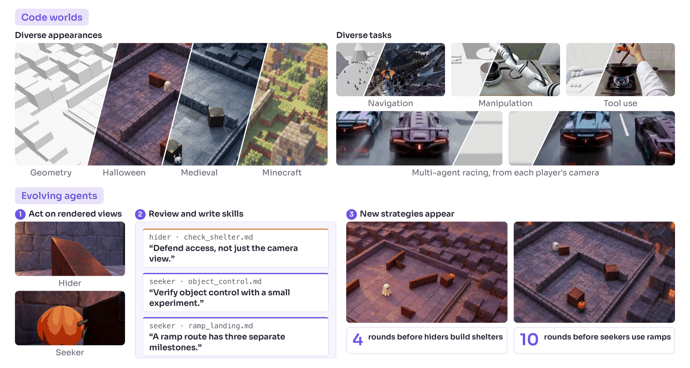

<p align="center">
  
</p>

<h1 align="center">AgentGarten</h1>
<p align="center">
  <b>Code Worlds for Evolving Agents</b>
</p>

<p align="center">
  <i>Code determines how the world changes, and the renderer learns how those changes should look.</i>
</p>

<p align="center">
  <a href="https://mirros.ai/report/agent-garten.pdf"></a>
  <a href="https://mirros-lab.github.io/agent-garten"></a>
  <a href="https://mirros.ai/blog/worlds-for-evolving-agents"></a>
  <a href="https://huggingface.co/MirroS-Lab/AgentGarten-renderer"></a>
</p>

<p align="center">
  
</p>

## Overview

Agents learn through interaction, and what they can learn is bounded by the
environment they practice in. That environment must be **faithful**, with
state, rules, and dynamics as consistent as those of the real world, and
**realistic**, with observations that follow the real world's visual
distribution.

**AgentGarten** builds real-time interactive environments that are both.
Simulators and game engines maintain persistent state and execute
program-defined rules, while a shared **neural renderer** generates the
agent's observations from the depth and surface normals each world exports.
Agents that practice in these environments improve from their own experience:
after each round they distill what happened into playbooks that later agents
inherit and build upon.

This is the official repository of AgentGarten. The neural renderer is
available now, with its training recipes and streaming inference; the code
worlds and the agent practice loop will be released here as well. The renderer
adapts [Cosmos3-Nano](https://huggingface.co/nvidia/Cosmos3-Nano) to geometry
conditions in three stages:

- **Bidirectional** rectified-flow training of whole clips from a first frame.
- **Autoregressive** block-causal training, with teacher forcing or diffusion
  forcing, sampled with a KV cache.
- **Adversarial Forcing**, which distills the autoregressive model into a
  few-step student. The replay of each rollout is exact, so losses on later
  blocks update how the student encodes its history, and a real-data
  discriminator with exact R1/R2 regularization improves visual quality.

## News

- [2026/10/08] AgentGarten technical report and [MirroS blog](https://mirros.ai/blog/worlds-for-evolving-agents) released.
- [2026/10/08] Training and inference code of the neural renderer released.

## Get started

### Installation

Python 3.11+ and PyTorch 2.9+ on a CUDA host.

```bash
git clone https://github.com/MirroS-Lab/AgentGarten.git
cd AgentGarten
pip install -e '.[data,media,wandb,te]'
cp .env.example .env    # weights, manifests, output root, interpreter
```

### Weights

Training starts from [Cosmos3-Nano](https://huggingface.co/nvidia/Cosmos3-Nano)
and encodes video with the
[Wan 2.2 VAE](https://huggingface.co/Wan-AI/Wan2.2-TI2V-5B):

```bash
hf download nvidia/Cosmos3-Nano \
  --include 'transformer/*' 'text_tokenizer/*' 'assets/negative_prompt.json' \
  --local-dir weights/Cosmos3-Nano
hf download Wan-AI/Wan2.2-TI2V-5B Wan2.2_VAE.pth --local-dir weights/Wan2.2-TI2V-5B
```

Point `WM_COSMOS3_NANO` and `WM_WAN22_VAE` in `.env` at them.

### Inference

`Cosmos3Stream` runs the renderer block by block with a bounded KV cache.
Each block is denoised in a few steps and then committed to the cache, so the
conditions of the next block can depend on what was just generated:

```python
import torch

from wm.inference.cosmos3 import inspect_artifact, load_artifact
from wm.inference.serving import prepare_serving
from wm.models.dmd import RCM_ENDPOINTS
from wm.models.flow import rf_interpolate, rf_x0
from wm.networks.cosmos3.streaming import Cosmos3Stream, StreamPolicy

artifact = load_artifact(inspect_artifact("weights/AgentGarten-renderer"))
prepare_serving(artifact.student)    # serving kernels and CUDA graphs
stream = Cosmos3Stream(artifact.student, StreamPolicy())

# anchor: the clean first-frame latent; every condition holds the text context
# and the depth and normal latents of one chunk.
stream.start(anchor, first_condition)
block = (1, anchor.shape[1], stream.policy.block_frames, *anchor.shape[3:])
for condition in blocks:    # one block is 4 latent frames
    clean = None
    for sigma in RCM_ENDPOINTS:
        sigma = torch.tensor([sigma], device=anchor.device)
        noise = torch.randn(block, device=anchor.device, dtype=anchor.dtype)
        noisy = noise if clean is None else rf_interpolate(clean, noise, sigma)
        clean = rf_x0(noisy, sigma, stream.denoise(noisy, sigma, condition))
    stream.commit(clean, condition)
```

`prepare_serving` serves the transformer with hand-written Triton kernels,
cuBLAS matrix products, and CUDA graphs, without `torch.compile`. Kernel JIT
and graph capture happen on first use, so warm the input shapes before
serving.

To render the validation clips of a checkpoint without training, add
`train.max_iterations=0 train.validate_at_start=true
trainer.callbacks.samples.every_n=1` to its training command. Comparison
videos (depth, normal, ground truth, sample) are written under `samples/`.
To decode RGB faster, attach the
[TAEHV](https://github.com/madebyollin/taehv) `taew2_2_super.pth` decoder with
one more override; encoding stays on the Wan encoder:

```text
model.conditioner.codec.decoder={_target_:wm.codecs.TAEW22SuperDecoder,pretrained_path:/path/to/taew2_2_super.pth}
```

### Training

**Data.** A JSONL manifest, one clip per line, with paths relative to the
manifest:

```json
{"video": "clips/0001.mp4", "depth": "clips/0001_depth.npy", "normal": "clips/0001_normal.mp4",
 "caption": "A car drives along a coastal road.", "depth_scale": 1.0}
```

**Launch.**

```bash
bash scripts/run.sh experiment=cosmos3/bidirectional                         # one node, all GPUs
NNODES=4 NODE_RANK=0 MASTER_ADDR=host0 bash scripts/run.sh experiment=...    # on every node
```

## TODO

- [x] Training code of the neural renderer: bidirectional, autoregressive, and Adversarial Forcing
- [x] Streaming inference with a bounded KV cache and serving kernels
- [x] Technical report and blog release
- [x] Neural renderer checkpoints: [MirroS-Lab/AgentGarten-renderer](https://huggingface.co/MirroS-Lab/AgentGarten-renderer)
- [ ] Real-time rendering engine: streaming server and interactive frontend
- [ ] Code worlds and the agent practice loop: rounds of play, review, and playbooks

## Acknowledgements

We sincerely thank the teams behind the following projects for making their work available to the community:

| Component | Projects |
|---|---|
| Base video model | [Cosmos 3](https://arxiv.org/abs/2606.02800) |
| Video autoencoder | [Wan 2.2](https://huggingface.co/Wan-AI/Wan2.2-TI2V-5B), [TAEHV](https://github.com/madebyollin/taehv) |
| Distillation | [DMD2](https://arxiv.org/abs/2405.14867), [Self Forcing](https://arxiv.org/abs/2506.08009), [rCM](https://github.com/NVlabs/rcm) |

_... and many other excellent open-source projects._


## Citation

If you find AgentGarten useful, please cite:

```bibtex
@misc{mirros2026evolvingagents,
    title  = {AgentGarten: Code Worlds for Evolving Agents},
    author = {{MirroS Team}},
    year   = {2026},
    month  = {Oct},
    url    = {https://mirros.ai/blog/worlds-for-evolving-agents},
    note   = {Blog post}
}
```
